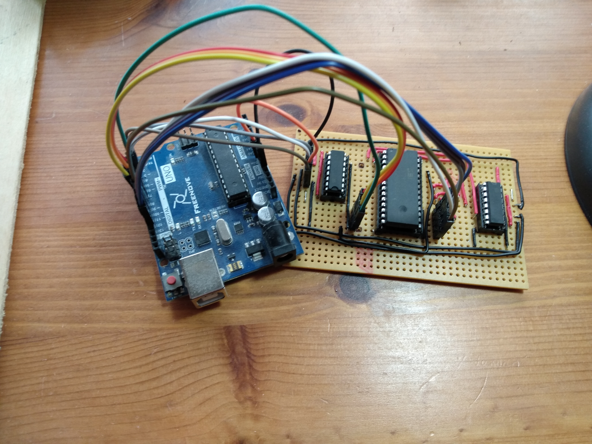

# 28C256 EEPROM PROGRAMMER
Made for part of a larger project in which I am trying to make a computer based
of the 6502 micro-processor (work-in-progress at time of writing).

Two 74HC595 shift registers are used to set the address.
I have build a specialist piece of hardware [image below] which is connected to
the arduino to interface with the 28C256. Other EEPROMS are not supported.

